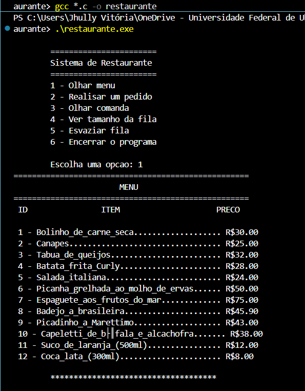
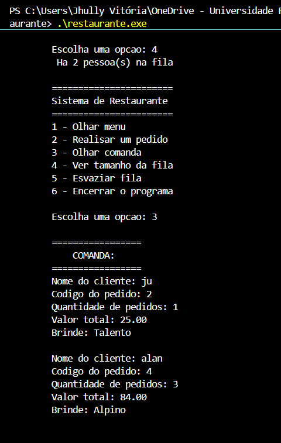

# 🍽️ Sistema de Restaurante em C

Um sistema robusto de gerenciamento de pedidos de restaurante desenvolvido em **C**. O projeto aplica conceitos avançados de Estruturas de Dados e manipulação de memória para simular o fluxo real de um estabelecimento: leitura dinâmica de cardápio, ordenação de clientes em fila, cálculo de comandas e distribuição de brindes.

## Demonstração do Sistema

<p align="center">
  <!-- Imagem da compilação e leitura do menu -->
  
  <!-- Imagem do processamento da fila com as comandas -->
  
</p>

## Funcionalidades

*   **Cardápio Dinâmico:** Os itens disponíveis não estão fixos no código; o sistema lê e exibe as opções diretamente de um arquivo de texto.
*   **Gerenciamento de Fila:** Os pedidos recebem o nome do cliente, código e quantidade, sendo inseridos em uma fila de espera para processamento.
*   **Acompanhamento em Tempo Real:** Permite verificar a qualquer momento quantos clientes estão aguardando na fila.
*   **Fechamento de Comanda e Brindes:** O sistema atende a fila, calcula o valor exato gasto por cada cliente e consome um brinde retirado diretamente do topo de uma pilha de chocolates.
*   **Gestão de Memória Segura:** Opções para esvaziar a fila e liberar adequadamente a memória antes de encerrar o programa.

## Estruturas de Dados

Este projeto foi modularizado para separar a lógica das estruturas e aplicar boas práticas de programação em C:

*   **Ponteiros e Alocação Dinâmica:** Uso intensivo de ponteiros (`*`) e funções de alocação de memória (como `malloc` e `free`) para criar e destruir os "nós" dos clientes e dos brindes sob demanda, otimizando o uso da RAM.
*   **Manipulação de Arquivos (File I/O):** Leitura de dados externos via ponteiros de arquivos (`FILE *`). O sistema carrega os produtos através do arquivo `Menu.txt` e empilha os brindes iniciais carregando o `Chocolates.txt`.
*   **Fila (Queue):** Implementada para o gerenciamento de pedidos utilizando o conceito FIFO (*First In, First Out*). O primeiro cliente a pedir é o primeiro a receber a comanda.
*   **Pilha (Stack):** Implementada para a distribuição de brindes utilizando o conceito LIFO (*Last In, First Out*). O último chocolate a ser colocado no recipiente (pilha) é o primeiro a ser retirado e entregue ao cliente.

## Como compilar e executar

**Pré-requisito:** Ter o compilador **GCC** instalado na sua máquina.

1.  **Clone o repositório:**
    ```bash
    git clone [https://github.com/JhullyVitoria/Trabalho_ed01.git](https://github.com/JhullyVitoria/Trabalho_ed01.git)
    ```
2.  **Acesse a pasta do projeto:**
    ```bash
    cd Trabalho_ed01/Sistema_de_Restaurante
    ```
3.  **Compile o código:**
    O projeto é modular (dividido em arquivos `.c` e `.h`). Para compilar corretamente linkando todas as dependências, utilize o comando:
    ```bash
    gcc *.c -o restaurante
    ```
4.  **Execute o programa gerado:**
    *   **No Windows:** `.\restaurante.exe`
    *   **No Linux/Mac:** `./restaurante`
